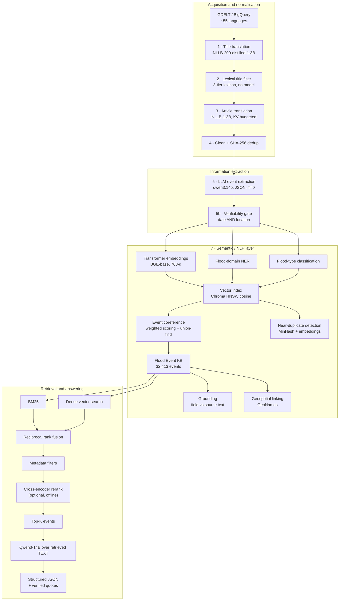

<div align="center">




**A flood-event intelligence and semantic retrieval system over 1.55M multilingual news articles.**

</div>

---

## Problem

Large-scale multilingual news carries an enormous amount of flood information, and almost none of
it is structured. Keyword matching cannot solve this for three separate reasons:

1. **It cannot tell a flood from the word "flood."** "Flood of applications", "floodlights",
   "landslide victory", a flood *warning*, a flood *insurance* bill and a retrospective on a flood
   ten years ago all match `flood`. Only one kind of article describes an event that happened.
2. **It cannot see that two articles are the same flood.** "Heavy rainfall caused severe flooding
   across three districts" and "Intense rains triggered widespread inundation in three districts"
   share almost no words. In this corpus, 4,871 separate articles describe the single July 2025
   Texas flood.
3. **It cannot answer a question.** "Which flash floods in the Himalayas killed more than twenty
   people?" is not a string. It needs a semantic representation, a date, a place resolved to a
   gazetteer, a flood type, and a count that some article actually printed.

So the system is an NLP problem end to end: represent, detect, classify, extract, link, verify,
retrieve.

---

## The NLP solution

```
transformer representations → vector search → flood-domain NER → event extraction
→ flood-type classification → semantic deduplication → event coreference → clustering
→ source grounding → geospatial normalisation → hybrid retrieval (BM25 + dense + RRF)
→ reranking → LLM structured extraction → evaluation against human annotation
```

Each component exists because a measured failure of the previous approach demanded it:

| Component | Model / method | The problem it solves |
|---|---|---|
| Sentence embeddings | `BAAI/bge-base-en-v1.5`, 768-d, cosine | two reports of one flood share meaning, not words |
| Vector index | ChromaDB, HNSW over cosine | 74,281 events must be searchable by meaning in milliseconds |
| NER | `dslim/bert-base-NER` + a flood-domain rule layer | who, where, which river, how many — as spans in the text |
| Flood-type classification | weighted lexicon; optional zero-shot Qwen3 | a river flood and a storm surge need different responses |
| Event coreference | weighted multi-signal scoring + union-find | 74,281 article-level mentions are 32,413 real floods |
| Near-duplicate detection | MinHash-LSH, plus an embedding pass | 21.9% of the flood corpus is syndicated republication |
| Grounding | surface-form matching back to the source text | an LLM's JSON is not evidence until the article says it |
| Geospatial linking | GeoNames via `geonamescache`, offline | "Bombay" and "Mumbai" are one place; "Sanford" is three |
| Hybrid retrieval | BM25 + dense, fused by reciprocal rank fusion | dense finds meaning, BM25 finds rare proper nouns |
| Reranking | cross-encoder interface, offline-gated | precision at the top of a short candidate list |
| Structured answering | Qwen3-14B over retrieved **text** | a schema-shaped answer with verbatim quoted evidence |

Everything runs offline on one RTX 4060 Ti. Nothing is downloaded at run time and no data leaves
the machine.

---

## Architecture



The LLM never sees an embedding. The vector index decides **which** articles it reads; it then
reads their natural language and nothing else.

---

## What the system produces, measured

Every number below was read off artifacts on disk, produced by the run that wrote them. Reports
live beside the data in `data/events/*_report.md`.

### Corpus

| | records |
|---|---:|
| stage-5 extraction records on disk | 1,555,628 |
| unique articles (`<year>/<month>/<article_id>`) | 1,550,353 |
| the model accepted as one real flood event | 225,872 (14.6%) |
| also verifiable — an exact date **and** a named place | **74,281** (4.8%) |

| year | articles | contains a flood event | verifiable |
|---|---:|---:|---:|
| 2021 | 171,725 | 35,367 | 15,644 |
| 2022 | 151,280 | 28,748 | 7,756 |
| 2023 | 381,411 | 53,932 | 17,032 |
| 2024 | 490,943 | 59,303 | 16,373 |
| 2025 | 354,994 | 48,522 | 17,476 |
| **total** | **1,550,353** | **225,872** | **74,281** |

### Semantic layer

| Stage | Measured output | Cost |
|---|---|---|
| Embeddings | 74,281 vectors × 768-d in Chroma | 5m 40s, 219 events/s, 2.50 GiB peak VRAM |
| Flood-domain NER | 3,795,927 entities over 74,281 documents (1,683,926 model · 1,692,468 rule · 419,533 slot) | 38m 24s on GPU |
| Flood-type classification | 25,056 typed (33.7%), 49,225 abstentions | 5m 50s, 213 docs/s, CPU |
| Event coreference | 74,281 mentions → **32,413 events** (56.4% reduction), 41,868 links accepted | 36s |
| Near-duplicate detection | 994,372 lexical pairs, 13,999 groups, 49,272 removable articles (**21.9%**); 8,226 further candidates only the embeddings found | 23m 21s |
| Grounding | 602,917 field assertions checked; 90.5% grounded on average, 51.7% of articles fully grounded | 1m 1s |
| Geospatial linking | 130,402 distinct mentions → 26,097 resolved / 2,869 ambiguous; 57.8% of extractions have at least one place on the map; 16,947 of 32,413 events get a centroid | 11s |
| Hybrid retrieval | 249 ms mean end-to-end over 8 queries (embed ~270 ms cold, 15–30 ms warm; BM25 ~150 ms; fusion <1 ms) | — |
| LLM structured answering | qwen3:14b over retrieved article text, ~2 s/query-document; quotes checked against the evidence | — |
| Title prefilter (distant supervision) | ROC AUC 0.908 against the LLM's own labels on 60,000 held-out titles | 1m 5s |

### The five largest consolidated events

| articles | dates | country | flood type | event |
|---:|---|---|---|---|
| 4,871 | 2025-07-01 → 07-10 | United States | Flash Flood | Texas Hill Country floods |
| 2,974 | 2023-09-01 → 09-19 | Libya | Flash Flood | Derna dam failure / Storm Daniel |
| 1,768 | 2024-10-08 → 11-05 | Spain | Flash Flood | Valencia floods |
| 837 | 2023-05-15 → 06-21 | Ukraine | Dam/Reservoir Flood | Kakhovka dam collapse |
| 836 | 2021-02-06 → 02-16 | India | Flash Flood | Uttarakhand (Chamoli) disaster |

Each of those is one row in `consolidated_events.jsonl` with every source article attached — which
is the entire point of the coreference stage.

### The title prefilter, and what it would buy

`title_classifier/train_title_classifier.py` fits TF-IDF (word 1–2 grams + character 3–5 grams) into
logistic regression on 300,000 titles, using stage 5's own verdicts as **distant supervision**. So
every figure is agreement with the LLM, not truth — but that is exactly the right target for a
component whose job is to not drop what the LLM would have kept.

| held out: 60,000 titles | value |
|---|---:|
| ROC AUC | 0.9079 |
| average precision | 0.6463 |
| macro F1 @ 0.5 | 0.7563 |

| keep this much of the LLM's positives | threshold | corpus still sent to the 14B model | LLM calls saved |
|---|---:|---:|---:|
| 99% | 0.0212 | 63.9% | **36.1%** |
| 98% | 0.0410 | 56.2% | 43.8% |
| 95% | 0.1047 | 44.6% | 55.4% |
| 90% | 0.2151 | 35.0% | 65.0% |

At 99% recall a 109 KB linear model removes a third of the 14B model's work. That is the argument
for keeping cheap compute early and expensive compute late, quantified.

### Support rate by field (grounding)

| field | assertions | supported by the source text |
|---|---:|---:|
| locations | 283,855 | 99.6% |
| rivers | 12,559 | 99.4% |
| cause | 14,756 | 97.1% |
| deaths | 33,619 | 94.8% |
| missing | 20,776 | 94.9% |
| flood type | 25,056 | 93.8% |
| houses destroyed | 7,885 | 93.4% |
| houses damaged | 17,210 | 89.2% |
| affected people | 48,323 | 88.3% |
| evacuated | 21,844 | 85.1% |
| displaced | 7,879 | 80.8% |
| injured | 7,364 | 79.8% |
| rainfall (mm) | 3,728 | 76.5% |
| **country** | 13,812 | **72.7%** |
| **event date** | 84,251 | **64.1%** |

The two weak fields are the informative ones, and neither is a bug:

- **Dates.** 16,164 of the 30,260 ungrounded dates are *weekday-relative* — the article says
  "flooding on Saturday" and the model resolved it against the publication date. The date is
  inferred, not stated, so it is correctly marked ungrounded.
- **Countries.** A Malaysian outlet writing for Malaysian readers rarely prints the word
  "Malaysia". The model supplies it from world knowledge. Usually right, always unsupported.

---

## Repository layout

| Folder | Stage | What it does |
|---|---|---|
| [1_translate_titles/](1_translate_titles/) | 1 | Translates **titles only** with NLLB-200. Cross-language batching, 8 reader threads, background writer. The output JSONL *is* the checkpoint. |
| [2_filter_titles/](2_filter_titles/) | 2 | Three-tier flood lexicon — guards, strong terms, weak+context. No model, no embeddings, 45 s for 1.38 M titles. 81/81 unit tests. |
| [3_translate_articles/](3_translate_articles/) | 3 | Full-article translation. KV-slot budgeting, language-sorted work, sentence chunking, resumable checkpoints. The heaviest stage. |
| [4_clean_dedup/](4_clean_dedup/) | 4 | Nine ordered text-cleaning stages, validators, SHA-256 exact deduplication across 52 workers. |
| [5_english_only/](5_english_only/) | 4b | Projects the cleaned corpus down to the three fields extraction needs: `id`, `title`, `text`. |
| [6_extract_events/](6_extract_events/) | 5–6 | Ollama structured extraction, analytics, CSV flattening, live dashboard. |
| **[7_semantic_layer/](7_semantic_layer/)** | **7** | **The semantic layer: embeddings, vector index, NER, flood-type classification, coreference, dedup, grounding, geocoding, hybrid search, LLM answering.** |
| [title_classifier/](title_classifier/) | — | Distantly-supervised title classifier (TF-IDF + logistic regression) as a cheap prefilter in front of the 14B model. |
| [evaluation/](evaluation/) | — | Stratified annotation sampling and scoring. The only place quality metrics come from. |

---

## Two identities, never confused

| | key | what it is |
|---|---|---|
| mention | `uid = "<year>/<month>/<article_id>"` | one article's extraction |
| event | `event_id = "E-<year>-<n>"` | one real-world flood, cited by 1..n uids |

`article_id` alone is not a key — every year's crawl restarts its numbering. Neither is
`<year>/<article_id>`, which was the original plan and does not survive the data: **2,075
article_ids occur in two different months of the same year and are different articles.**

```
2021/2021_01/article_000001527   "At least 96 killed ... as quake, floods hit Indonesia"
2021/2021_05/article_000001527   "Parapat City Paralyzed, Hit by Floods and Landslides"
```

The month is part of the key, which also makes a uid resolve to exactly one file on disk.

---

## The three models

All run **fully offline** — NLLB and BGE with `HF_HUB_OFFLINE=1`, Qwen3 through a locally pulled
Ollama model.

| | Stages 1 + 3 · Translation | Stage 5 + 7 · Generation | Stage 7 · Representation |
|---|---|---|---|
| **Model** | NLLB-200-distilled-1.3B | Qwen3-14B | BGE-base-en-v1.5 |
| **Type** | Encoder–decoder (seq2seq) | Decoder-only causal LM | Encoder (bi-encoder embeddings) |
| **Parameters** | 1.37 B | 14.8 B | 109 M |
| **Runtime** | `transformers` + PyTorch | Ollama HTTP server | `sentence-transformers` |
| **Precision** | fp16 | Q4_K_M (4-bit GGUF) | fp32 |
| **VRAM, weights only** | ~2.56 GiB | ~8.7 GiB | ~0.42 GiB |
| **Throughput here** | ~6,900 out-tok/s (batched) | ~0.5 article/s/worker | 219 events/s |
| **Licence** | CC-BY-NC 4.0 | Apache 2.0 | MIT |

`dslim/bert-base-NER` (108 M, CoNLL-2003) is used for token classification. It is **not** a
flood-trained model, and the NER stage is explicit about that: see below.

---

## Honest limits

Stated here rather than buried, because each one changes how the outputs should be read.

**The NER is a generic tagger plus domain rules, not a fine-tuned flood NER model.**
`dslim/bert-base-NER` knows PER/ORG/LOC/MISC and nothing about floods. RIVER, FLOOD_TYPE,
WEATHER_EVENT, INFRASTRUCTURE, CASUALTY, EVACUATION and DAMAGE come from a lexicon-and-pattern
layer written for this corpus, and every entity carries a `source` field saying which produced it
(`model` / `rule` / `slot`). Training a real flood NER model needs a span-annotated corpus;
`evaluation/make_annotation_sample.py --task ner` produces the sample to start one.

**Flood-type coverage is 33.7%, deliberately.** `Unknown` is an abstention, not a class. The rule
model refuses to type an article unless the cue evidence clears a threshold and beats the
runner-up — a single mention of the word "river" must never make something a River Flood. Guessing
a type to fill the column would corrupt every downstream count.

**No accuracy, F1 or nDCG figure is reported anywhere in this repository**, because no gold set has
been annotated yet. `evaluation/score.py` refuses to run on an unannotated file rather than print a
number nobody measured. Grounding rates are *support* rates — "the article says this" — not
correctness.

**The cross-encoder reranker is an interface, not a running component.** No suitable cross-encoder
is in the local HF cache, and this system does not download models. `search.py` reports
`reranker: off` and keeps the fusion order. Drop a local cross-encoder path into
`7_semantic_layer/config.json` and it switches on.

**Geocoding resolves 57.8% of extractions to at least one GeoNames point.** The offline gazetteer
holds ~34k cities; "Kampung Laut Batu 10" is not in it, and an ambiguous name is reported as
ambiguous with all candidates rather than snapped to the most populous guess.

---

## Engineering findings

Measured on one RTX 4060 Ti (16 GB) under Windows' WDDM driver — not taken from model cards.

**A missing path override is silent, and costs 68% of your corpus.** The article trees are not
laid out consistently across years: 2021 and 2023–2025 nest files one level deeper in `articles/`
than 2022 does. A missing override does not raise — `load_article` just returns `None` and the
stage runs happily on titles alone. It was caught by counting files per year (2023: 16,503 under
`articles/`, zero beside it), after which 50,881 of 74,281 bodies became visible and RIVER coverage
in the index went from 8.3% to 40.3%.

**Prefetch the corpus, not the model.** One article is one small JSON file, and a stage that opens
them inline spends most of its time waiting on the filesystem while the GPU idles. A 16-thread
read-ahead window with bounded lookahead (`common.iter_bodies`) took flood-type classification from
34 to 212 documents/second over the full 74,281, and NER from ~9 to ~32. Nothing about either model
changed. (The two NER measurements are only approximately comparable: the article-path fix landed
between them, so the later run was reading far more text per document.)

**Filling VRAM is 9× slower, not faster.** 512×76 tokens → 5,509 out-tok/s at 8.97 GiB; 1536×76 →
**617** out-tok/s at 21.78 GiB *on a 16 GB card*. Nothing crashes: WDDM silently spills the
oversized allocation to host RAM over PCIe. Target the throughput knee (7.5–9.5 GiB), not maximum
occupancy. Because the driver spills instead of raising,
`set_per_process_memory_fraction(0.88)` is what restores a genuine, catchable `OutOfMemoryError`.

**Budget KV slots, not source tokens.** Peak memory is dominated by the decoder KV cache:
`slots = batch × (src + projected_new)`, `peak_GiB ≈ 2.56 + slots/10922`. Budgeting on source
tokens alone caused **19 OOM events** in an early 3,000-article run — a wide batch of short chunks
looks cheap while reserving an enormous decode cache.

**Sort the work by language.** NLLB encodes source language as a prefix token, so a batch cannot
mix languages. Article-id order → ~22 chunks/batch → 550 out-tok/s. Language-sorted → ~500
chunks/batch → **~6,900 out-tok/s**.

**`q8_0` KV cache is load-bearing for extraction.** Ollama allocates
`num_ctx × OLLAMA_NUM_PARALLEL` up front. At f16 that is 7.5 GiB of cache on top of 8.7 GiB of
weights — **~16.2 GiB on a 16 GB card**, which spills to CPU at roughly 3× the cost. At `q8_0` it
lands at ~12.4 GiB and stays 100% on GPU.

**Summing article scores lets big events swallow the query.** Folding article hits onto events by
summing their fusion scores made the 90-article Yalta 2021 cluster the top result for "Assam floods
June 2021": ninety weak matches outscored one on-target report. An event now scores its *best*
article with a logarithmic bonus for corroboration, so agreement breaks ties instead of deciding
the ranking.

**A metadata filter applied after fusion starves the result set.** The top-100 fused candidates for
"Assam floods" contain almost nothing inside a one-month date window. Filters the vector store can
evaluate (`year`, `flood_type`, `deaths`) are pushed into Chroma; the rest trigger a 10× deeper
fetch first.

**Case-insensitive river patterns invent rivers.** `\b[Rr]ivers?\s+([A-Z]\w+)` compiled with
`re.I` makes `[A-Z]` match lowercase, so "river overflowed", "river basin" and "river in Cendoro
village" all became named watercourses. The top-25 river list was the fastest way to see it.

**A 14B model resolves relative dates silently.** 19% of all extracted flood dates are weekday
references resolved against the publication date. Without a grounding pass, they are
indistinguishable from dates the article printed.

**A gazetteer's alternate names are a trap in both directions.** GeoNames lists "Cherbourg" as an
alternate name of Port Angeles and "Patani" as one of Putney, so matching primary and alternate
names equally turned real cities into ambiguous ones — ranking primary-name matches first halved
the ambiguity rate (123 → 71 per 3,000 mentions). In the other direction, letting a *fragment* of a
mention match a country put the Texas highway "US 281" in the geometric centre of the United
States; a country now only resolves when the whole mention names it.

**Deduplication is not one question.** MinHash over 5-word shingles finds 994,372 pairs and 49,272
removable articles — literally the same story, safe to collapse. Embeddings at cosine ≥ 0.95 find
8,226 further pairs with almost no shingle overlap, which are *either* rewrites of one report *or*
two different floods described in near-identical language. Those are emitted as candidates and
never merged; separating them needs date, location and country agreement, which is what event
coreference does.

---

## Why the lexical filter keeps 16.85%

Stage 2 runs no model at all. Three tiers over a normalised title:

1. **Guards** — metaphors and homonyms are *masked out of the text* rather than rejecting the
   title: `flood of migrants`, `floodgates`, `floodlights`, `landslide victory`, `Iowa State
   Cyclones`, `rescue dog`, `perfect storm`, `Monsoon Session`, `winter storm`. So *"Flood of
   criticism"* dies but *"Flood of donations as floods hit Assam"* survives.
2. **Strong** — sufficient alone: the flood family, qualified or destructive rain, waterlogging,
   inundation, submersion, cloudburst, `in spate`, dam and embankment failure, storm surge, named
   cyclones.
3. **Weak + context** — `rescue`, `evacuation`, `death toll`, `red alert`, `landslide`, `power
   outage` count **only** when an independent water word is also present.

Bare `rain` is context-only, never strong. Word boundaries matter: `\brain` correctly ignores
B**rain**, T**rain**ing and Bah**rain**.

*Why 16.85% and not ~2%:* this is a flood crawl, not general news. The naive substring rate for
`flood`/`rain`/`cyclone` is 17.89%, so ~17% is the right order of magnitude.

---

## Running it

Each folder is self-contained and carries its own README with the full argument reference.

```bash
# Stages 1-6 — acquisition through extraction
cd 1_translate_titles   && python translate_titles.py --year 2021
cd 2_filter_titles      && python filter_flood_titles.py && python test_lexicon.py
cd 3_translate_articles && python translate_flood_articles.py --config config.json
cd 4_clean_dedup        && python run_year.py --year 2021
cd 5_english_only       && python extract_english.py
cd 6_extract_events     && python extract.py --config config.json && python to_csv.py

# Stage 7 — the semantic layer (see 7_semantic_layer/README.md)
cd 7_semantic_layer && pip install -r requirements.txt
python build_index.py --limit 300 --years 2021   # smoke test: model, GPU, Chroma
python build_index.py                            # 74,281 vectors, ~6 min
python flood_type.py                             # ~6 min
python ner.py                                    # ~38 min on GPU
python build_index.py --refresh-metadata         # fold both into the index
python cluster_events.py                         # ~36 s
python near_dup.py --semantic                    # ~23 min
python geocode.py
python ground.py
python search.py "Assam floods June 2021"
python search.py "how many died in the Kishtwar cloudburst" --llm
python search.py --benchmark
```

Ollama server environment for stages 5 and 7:

```
OLLAMA_NUM_PARALLEL    = 12      # concurrent slots; client workers must be <= this
OLLAMA_KV_CACHE_TYPE   = q8_0    # 8-bit KV cache — see above
OLLAMA_FLASH_ATTENTION = 1
```

### Evaluation

```bash
cd evaluation
python make_annotation_sample.py --task detection  --n 200
python make_annotation_sample.py --task flood_type --n 150
python make_annotation_sample.py --task ner        --n 60
python make_annotation_sample.py --task clustering --n 200
python make_annotation_sample.py --task extraction --n 100
python make_annotation_sample.py --task retrieval

# annotate the gold/ files, then
python score.py --task detection      # P/R/F1/accuracy + confusion matrix
python score.py --task flood_type     # macro/weighted F1, per class, abstention cost
python score.py --task ner            # entity-level P/R/F1, strict and relaxed
python score.py --task extraction     # per-field accuracy and set F1
python score.py --task clustering     # pairwise coreference P/R/F1
python score.py --task retrieval      # Recall@K, Precision@K, MRR, nDCG@K
```

Samples are stratified and seeded, so two annotators can be handed identical rows, and the scorer
refuses to report a metric for an unannotated file.

**Host used for every measurement:** RTX 4060 Ti (16 GB GDDR6) · 26-core CPU · 512 GB RAM ·
Windows 10 (WDDM) · Python 3.14.6 · PyTorch 2.11+cu128 · transformers 5.13 ·
sentence-transformers 6.0.1 · chromadb 1.5.9 · faiss-cpu 1.15.

---

## Notes on the data

The corpus itself is **not in this repository** — roughly 25 GB across ~5.2 M files. Run state,
checkpoints, resume indexes, vector stores and all `.jsonl`/`.csv`/`.npy` artifacts are excluded;
every stage regenerates them and each one resumes from its own output.

Known inconsistencies worth resolving before a fresh run:

- `3_translate_articles/config.json` sets `model.dir` to a path that does not exist on a fresh checkout —
  point it at your local NLLB checkpoint.
- `3_translate_articles/README.md` and `3_translate_articles/config.json` disagree on `kv_slot_budget`,
  `max_batch_size` and the peak-VRAM constant. **The config is authoritative** (`slots/10922`, the
  analytical value at 96 KiB per slot); the README quotes an earlier empirical fit, which landed
  within 0.54 GiB MAE of it.
- `7_semantic_layer/config.json` carries per-year `articles_root_overrides`. Check them against the actual
  directory layout before a run — a wrong one fails silently. See the first engineering finding.
- The 2021-era base configs still point at intermediates that have since moved under `data/`:
  `3_translate_articles/config.json` (`data_dir`, `events_dir`, `log_file`) and the default input in
  `2_filter_titles/*.py`. The per-year configs (`config_2022.json` … `config_2025.json`) all resolve.
  These were already stale before the folders were renamed; the rename only made them legible.
