<div align="center">


</div>

---

> **1,383,600** multilingual news articles become **13,333** verifiable, structured flood events —
> a **104× compression** — through six stages that spend cheap compute early and expensive
> compute late.

Every number in this README was measured from artifacts on disk, not estimated.

---

## Stage map

```mermaid
flowchart LR
    A["<b>GDELT / BigQuery</b><br/>1,383,600 articles<br/>~55 languages"]
    B["<b>1 · Title translation</b><br/>NLLB-200-distilled-1.3B<br/>fp16 · offline · ~90 titles/s"]
    C["<b>2 · Lexical flood filter</b><br/>3-tier lexicon · no model<br/>45 seconds"]
    D["<b>3 · Article translation</b><br/>NLLB-1.3B · KV-budgeted<br/>language-sorted batching"]
    E["<b>4 · Clean + deduplicate</b><br/>9 text stages · SHA-256<br/>52 workers · 62.9 s"]
    F["<b>5 · LLM extraction</b><br/>qwen3:14b · JSON mode<br/>think=false · T=0"]
    G["<b>6 · Flatten to CSV</b><br/>two-pass schema discovery<br/>extractions.csv"]

    A -->|1,383,600| B
    B -->|1,383,600| C
    C -->|233,153 · 16.85%| D
    D -->|233,153| E
    E -->|171,742 · 73.7%| F
    F -->|28,823 → 13,333| G
```





## The funnel



| Stage | In | Out | Retained | What it removes |
|---|---:|---:|---:|---|
| 0 · GDELT acquisition | — | 1,383,600 | — | non-flood-themed news |
| 1 · Title translation | 1,383,600 | 1,383,600 | 100 % | nothing (adds `translated_title`) |
| 2 · Lexical title filter | 1,383,600 | 233,153 | **16.85 %** | titles with no flood signal |
| 3 · Article translation | 233,153 | 233,153 | 100 % | nothing (adds `translated_text`) |
| 4 · Validate + dedup | 233,153 | 171,742 | **73.7 %** | 14,392 under 100 words · 22 boilerplate-only · 46,997 exact duplicates |
| 5 · LLM extraction | 130,477 \* | 28,823 | **22.1 %** | warnings, forecasts, policy, studies, recovery, multi-event |
| 5b · Verifiability gate | 28,823 | 13,333 | **46.3 %** | events lacking an exact date **or** a flooded location |

\* Stage 5 is **9 of 12 months complete**. 40,839 articles remain (`2021_10` 14,703 · `2021_11` 13,309 · `2021_12` 12,827).

**End-to-end: 13,333 / 1,383,600 = 0.96 %.**

---

## Repository layout

| Folder | Stage | What it does |
|---|---|---|
| [title_tranlator/](title_tranlator/) | 1 | Translates **titles only** with NLLB-200. Cross-language batching, 8 reader threads, background writer. The output JSONL *is* the checkpoint. |
| [tilte_filter/](tilte_filter/) | 2 | Three-tier flood lexicon — guards, strong terms, weak+context. No model, no embeddings, 45 s for 1.38 M titles. 81/81 unit tests. |
| [translator/](translator/) | 3 | Full-article translation. KV-slot budgeting, language-sorted work, sentence chunking, resumable checkpoints. The heaviest stage. |
| [4cleanup/](4cleanup/) | 4 | Nine ordered text-cleaning stages, validators, SHA-256 exact deduplication across 52 workers. |
| [onlyeng/](onlyeng/) | 4b | Projects the cleaned corpus down to the three fields extraction needs: `id`, `title`, `text`. |
| [extract/](extract/) | 5–6 | Ollama structured extraction, analytics, CSV flattening, and a live web dashboard. |

---

## The two models

Both run **fully offline** — NLLB with `local_files_only=True` and `HF_HUB_OFFLINE=1`, Qwen3 through a locally pulled Ollama model. Nothing is downloaded at run time and no data leaves the machine.

| | Stages 1 + 3 · Translation | Stage 5 · Extraction |
|---|---|---|
| **Model** | NLLB-200-distilled-1.3B | Qwen3-14B |
| **Type** | Encoder–decoder (seq2seq) | Decoder-only causal LM |
| **Parameters** | 1.37 B | 14.8 B |
| **Runtime** | `transformers` + PyTorch, direct | Ollama HTTP server |
| **Precision** | fp16 | Q4_K_M (4-bit GGUF) |
| **VRAM, weights only** | ~2.56 GiB | ~8.7 GiB |
| **Licence** | CC-BY-NC 4.0 | Apache 2.0 |

---

## Engineering findings

Each of these was measured on one RTX 4060 Ti (16 GB) under Windows' WDDM driver — not taken from a model card.

**Filling VRAM is 9× slower, not faster.** 512×76 tokens → 5,509 out-tok/s at 8.97 GiB; 1536×76 → **617** out-tok/s at 21.78 GiB *on a 16 GB card*. Nothing crashed: WDDM silently spills the oversized allocation to host RAM over PCIe. Target the throughput knee (7.5–9.5 GiB), not maximum occupancy.

**Because the driver spills instead of raising, "halve the batch on OOM" cannot fire by default.** `set_per_process_memory_fraction(0.88)` restores a genuine, catchable `OutOfMemoryError` — which is what makes the recovery path real rather than decorative.

**Budget KV slots, not source tokens.** Peak memory is dominated by the decoder KV cache: `slots = batch × (src + projected_new)`, `peak_GiB ≈ 2.56 + slots/10922`. Budgeting on source tokens alone caused **19 OOM events** in an early 3,000-article run — a wide batch of short chunks looks cheap while reserving an enormous decode cache.

**Sort the work by language.** NLLB encodes source language as a prefix token, so a batch cannot mix languages. Article-id order → ~22 chunks/batch → 550 out-tok/s. Language-sorted → ~500 chunks/batch → **~6,900 out-tok/s**.

**Don't translate English.** ~39 % of the corpus is already English; round-tripping it costs GPU hours and can only degrade the text. Validated rather than assumed: over 4,000 articles, metadata and `langdetect` disagree on only **2.38 %** of English-tagged articles, and 28 of 35 disagreements are `langdetect`'s known Afrikaans false positive → genuine disagreement ~0.5 %.

**`q8_0` KV cache is load-bearing for extraction.** Ollama allocates `num_ctx × OLLAMA_NUM_PARALLEL` up front. At f16 that is 7.5 GiB of cache on top of 8.7 GiB of weights — **~16.2 GiB on a 16 GB card**, which spills to CPU and costs roughly 3× throughput. At `q8_0` it lands at ~12.4 GiB and stays 100 % on GPU.

**A missing language-table entry is silent.** The FLORES-200 code table is extracted from the *local tokenizer* rather than the published list, because the two genuinely disagree. A startup assertion checks that every code `langdetect` can emit is mappable — a missing `"es"` entry once silently marked **~15,700 Spanish articles** untranslatable.

---

## Why the lexical filter keeps 16.85 %

Stage 2 runs no model at all. Three tiers over a normalised title:

1. **Guards** — metaphors and homonyms are *masked out of the text* rather than rejecting the title: `flood of migrants`, `floodgates`, `floodlights`, `landslide victory`, `Iowa State Cyclones`, `rescue dog`, `perfect storm`, `Monsoon Session`, `winter storm`. So *"Flood of criticism"* dies but *"Flood of donations as floods hit Assam"* survives.
2. **Strong** — sufficient alone: the flood family, qualified or destructive rain, waterlogging, inundation, submersion, cloudburst, `in spate`, dam and embankment failure, storm surge, named cyclones.
3. **Weak + context** — `rescue`, `evacuation`, `death toll`, `red alert`, `landslide`, `power outage` count **only** when an independent water word is also present. This is what enforces "flooding is the primary subject".

Bare `rain` is context-only, never strong. Word boundaries matter: `\brain` correctly ignores B**rain**, T**rain**ing, and Bah**rain**.

*Why 16.85 % and not ~2 %:* this is a flood crawl, not general news. The naive substring rate for `flood`/`rain`/`cyclone` is 17.89 %, so ~17 % is the right order of magnitude. The lexicon lands just below it by removing metaphors while adding recall the substrings miss.

---

## Running a stage

Each folder is self-contained and carries its own README with the full argument reference.

```bash
# Stage 1 — translate titles
cd title_tranlator && pip install -r requirements.txt
python translate_titles.py --year 2021

# Stage 2 — lexical flood filter (no GPU, no model)
cd tilte_filter && python filter_flood_titles.py
python test_lexicon.py            # 81 unit tests

# Stage 3 — full article translation
cd translator && pip install -r requirements.txt
python translate_flood_articles.py --config config.json

# Stage 4 — clean + deduplicate
cd 4cleanup && pip install -r requirements.txt
python run_year.py --year 2021

# Stage 5 — structured extraction (needs a running Ollama with qwen3:14b)
cd extract && python extract.py --config config.json
python to_csv.py                  # stage 6 — flatten
```

Ollama server environment for stage 5:

```
OLLAMA_NUM_PARALLEL    = 12      # concurrent slots; client workers must be <= this
OLLAMA_KV_CACHE_TYPE   = q8_0    # 8-bit KV cache — see above
OLLAMA_FLASH_ATTENTION = 1
```

**Host used for every measurement:** RTX 4060 Ti (16 GB GDDR6) · 26-core CPU · 512 GB RAM · Windows 10 (WDDM) · Python 3.14.6 · PyTorch 2.11+cu128 · transformers 5.13.

---

## Notes on the data

The corpus itself is **not in this repository** — it is roughly 25 GB across ~5.2 M files. Run state, checkpoints, resume indexes, and all `.jsonl`/`.csv` artifacts are likewise excluded; every stage regenerates them and each one resumes from its own output.

Two known inconsistencies worth resolving before you run stage 3:

- `translator/config.json` sets `model.dir` to a path that does not exist on a fresh checkout — point it at your local NLLB checkpoint.
- `translator/README.md` and `translator/config.json` disagree on `kv_slot_budget`, `max_batch_size`, and the peak-VRAM constant. **The config is authoritative** (`slots/10922`, the analytical value at 96 KiB per slot); the README quotes an earlier empirical fit, which landed within 0.54 GiB MAE of it.
